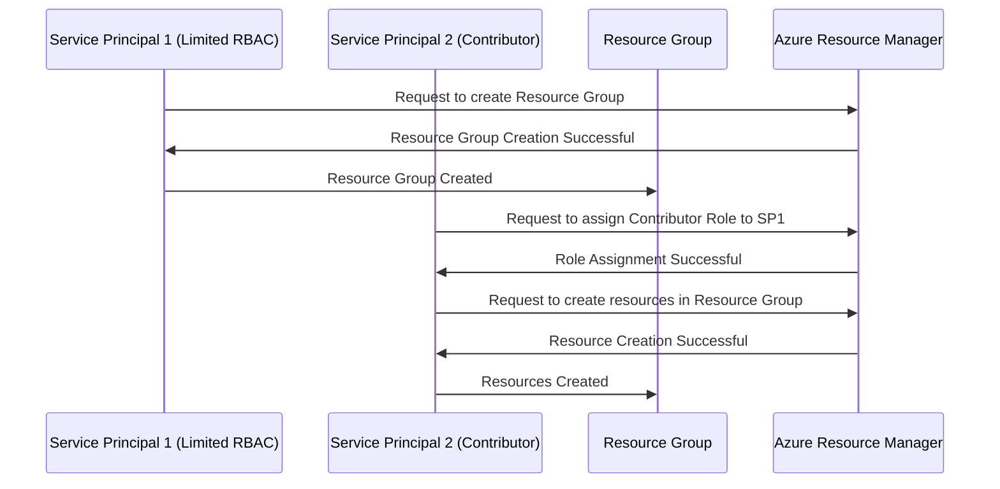

Here is an enhanced **PowerShell script** that queries Azure Support tickets from **multiple subscriptions** and appends the results to a single **CSV file**. It takes an array of subscription IDs, iterates through them, and consolidates the data.

---

### Script: Query Azure Support Cases Across Multiple Subscriptions and Append to CSV

Replace the following placeholders:
- **`<OUTPUT_FILE>`**: Path to your CSV file, e.g., `C:\support_tickets.csv`.

#### Script:
```powershell
# Step 1: Get Access Token using Azure CLI
$AccessToken = az account get-access-token --query accessToken -o tsv

# Step 2: Define an Array of Subscription IDs
$Subscriptions = @(
    "<SUBSCRIPTION_ID_1>",
    "<SUBSCRIPTION_ID_2>",
    "<SUBSCRIPTION_ID_3>"
)

# Step 3: Set API Version and CSV Output Path
$ApiVersion = "2020-04-01"
$OutputFile = "<OUTPUT_FILE>"

# Step 4: Set Headers for Authorization
$Headers = @{
    "Authorization" = "Bearer $AccessToken"
    "Content-Type"  = "application/json"
}

# Step 5: Loop Through Each Subscription and Query Support Tickets
$AllSupportTickets = @()

foreach ($SubscriptionId in $Subscriptions) {
    Write-Host "Querying support tickets for Subscription: $SubscriptionId..." -ForegroundColor Cyan

    # Define API Endpoint
    $Uri = "https://management.azure.com/subscriptions/$SubscriptionId/providers/Microsoft.Support/supportTickets?api-version=$ApiVersion"

    try {
        # Invoke REST API
        $Response = Invoke-RestMethod -Uri $Uri -Headers $Headers -Method Get

        # Extract and Format Ticket Details
        $Tickets = $Response.value | ForEach-Object {
            [PSCustomObject]@{
                "SubscriptionID" = $SubscriptionId
                "TicketID"       = $_.name
                "Status"         = $_.properties.status
                "Title"          = $_.properties.title
                "Severity"       = $_.properties.severity
                "CreatedDate"    = $_.properties.createdDate
                "ModifiedDate"   = $_.properties.modifiedDate
                "ServiceName"    = $_.properties.serviceName
                "ContactMethod"  = $_.properties.contactMethod
            }
        }

        # Add to the Consolidated List
        $AllSupportTickets += $Tickets
    }
    catch {
        Write-Error "Failed to retrieve support tickets for Subscription $SubscriptionId. Error: $_"
    }
}

# Step 6: Append or Create CSV File
if ($AllSupportTickets) {
    if (Test-Path $OutputFile) {
        # Append to Existing CSV
        $AllSupportTickets | Export-Csv -Path $OutputFile -NoTypeInformation -Append
    } else {
        # Create New CSV
        $AllSupportTickets | Export-Csv -Path $OutputFile -NoTypeInformation
    }
    Write-Host "Support tickets appended to $OutputFile successfully!" -ForegroundColor Green
} else {
    Write-Host "No support tickets found for the provided subscriptions." -ForegroundColor Yellow
}
```

---

### How It Works:
1. **Access Token**: Obtained using Azure CLI.
2. **Subscription Array**: `$Subscriptions` contains all the subscription IDs you want to query.
3. **API Call**: Loops through each subscription ID and queries the Azure Support tickets.
4. **Data Formatting**: Extracts key properties like `TicketID`, `Status`, `Title`, and others.
5. **CSV Handling**: Consolidates data into a single CSV file. If the file already exists, it appends data; otherwise, it creates a new file.

---

### Output CSV Example:

| SubscriptionID     | TicketID | Status | Title                | Severity | CreatedDate          | ModifiedDate         | ServiceName      | ContactMethod |
|---------------------|----------|--------|----------------------|----------|----------------------|----------------------|------------------|---------------|
| SUBSCRIPTION_ID_1   | 12345    | Open   | VM Performance Issue | Moderate | 2024-06-10T10:45:00Z | 2024-06-11T08:15:00Z | Virtual Machines | Email         |
| SUBSCRIPTION_ID_2   | 67890    | Closed | Storage Issue        | Critical | 2024-06-01T12:00:00Z | 2024-06-05T10:00:00Z | Storage Accounts | Phone         |

---

### Execution Steps:
1. Save the script as `Query-MultiSubSupportTickets.ps1`.
2. Replace the subscription IDs in `$Subscriptions` and set your output file path.
3. Run the script in PowerShell:
   ```powershell
   .\Query-MultiSubSupportTickets.ps1
   ```

---

### Prerequisites:
1. **Azure CLI** installed and logged in:
   ```bash
   az login
   ```
2. PowerShell 5.1 or later.

Let me know if you need further refinements or explanations! 🚀---

### How It Works:
1. **Access Token**: The script gets a Bearer token using `az account get-access-token`.
2. **Azure REST API Call**: Queries support tickets using `Invoke-RestMethod`.
3. **Data Transformation**: Extracts key properties from the JSON response into a `PSCustomObject`.
4. **CSV Handling**:
   - If the file exists, appends the new data.
   - If the file does not exist, creates a new CSV file.
5. **Output File**: Tickets are saved in the CSV file with the following columns:
   - `TicketID`
   - `Status`
   - `Title`
   - `Severity`
   - `CreatedDate`
   - `ModifiedDate`
   - `ServiceName`
   - `ContactMethod`

---

### Example CSV Output:

| TicketID | Status | Title                | Severity | CreatedDate          | ModifiedDate         | ServiceName      | ContactMethod |
|----------|--------|----------------------|----------|----------------------|----------------------|------------------|---------------|
| 12345    | Open   | VM Performance Issue | Moderate | 2024-06-10T10:45:00Z | 2024-06-11T08:15:00Z | Virtual Machines | Email         |

---

### Execution Steps:
1. Save the script as `Query-SupportTickets.ps1`.
2. Run the script in PowerShell:
   ```powershell
   .\Query-SupportTickets.ps1
   ```

3. Verify the CSV file at the specified path.

---

Let me know if you need additional customizations or enhancements! 🚀

In **PowerShell**, you can use the `Invoke-RestMethod` cmdlet to replicate the functionality of `curl`. Here's how to query **Azure Support cases** using the Azure REST API in PowerShell:

---

### Script: Query Azure Support Cases Using `Invoke-RestMethod`

Replace the placeholders:
- `<YOUR_SUBSCRIPTION_ID>`: Your Azure subscription ID.
- `<ACCESS_TOKEN>`: Azure access token (retrieved via Azure CLI).

#### Full Script:
```powershell
# Step 1: Get Access Token using Azure CLI
$AccessToken = az account get-access-token --query accessToken -o tsv

# Step 2: Define API Endpoint and Subscription ID
$SubscriptionId = "<YOUR_SUBSCRIPTION_ID>"
$ApiVersion = "2020-04-01"
$Uri = "https://management.azure.com/subscriptions/$SubscriptionId/providers/Microsoft.Support/supportTickets?api-version=$ApiVersion"

# Step 3: Set Headers for Authorization
$Headers = @{
    "Authorization" = "Bearer $AccessToken"
    "Content-Type"  = "application/json"
}

# Step 4: Invoke the REST API (equivalent to curl)
$Response = Invoke-RestMethod -Uri $Uri -Headers $Headers -Method Get

# Step 5: Display Results
$Response.value | Format-Table -Property id, name, @{N='Status';E={$_.properties.status}}, `
    @{N='Title';E={$_.properties.title}}, @{N='Severity';E={$_.properties.severity}}, `
    @{N='CreatedDate';E={$_.properties.createdDate}}
```

---

### Explanation:
1. **Access Token**: Obtained using Azure CLI.
   ```bash
   az account get-access-token --query accessToken -o tsv
   ```
2. **REST API Endpoint**:
   - Azure support tickets REST API endpoint:
     ```
     https://management.azure.com/subscriptions/<SUBSCRIPTION_ID>/providers/Microsoft.Support/supportTickets?api-version=2020-04-01
     ```

3. **Invoke-RestMethod**:  
   - Performs the REST API `GET` request equivalent to `curl`.

4. **Filter and Format**:  
   - Use `Format-Table` to display ticket properties such as `name`, `status`, `title`, etc.

---

### Example Output:
```
id                  name       Status   Title                  Severity  CreatedDate
--                  ----       ------   -----                  --------  -----------
/.../12345          12345      Open     VM Performance Issue   Moderate  2024-06-10T10:45:00Z
```

---

### Optional: Filter Results (e.g., Open Tickets Only)
You can add filtering to only display "Open" tickets:
```powershell
$OpenTickets = $Response.value | Where-Object { $_.properties.status -eq "Open" }
$OpenTickets | Format-Table -Property id, name, @{N='Status';E={$_.properties.status}}, `
    @{N='Title';E={$_.properties.title}}, @{N='Severity';E={$_.properties.severity}}, `
    @{N='CreatedDate';E={$_.properties.createdDate}}
```

---

### Prerequisites:
1. Ensure you have the **Azure CLI** installed and logged in:
   ```bash
   az login
   ```

2. Install the **`jq`** tool (optional for JSON parsing in the CLI but not required for PowerShell).

---

Let me know if you encounter any issues or need further refinements! 🚀
# Azure-RBAC
To query Azure Support cases using a **`curl`** command, you can utilize the **Azure Resource Manager REST API** for support tickets. Here's how:

---

### Prerequisites:
1. **Azure Authentication**: Get a **Bearer token** for authorization.
2. **Subscription ID**: Your Azure subscription ID.

---

### Step 1: Get an Access Token
Run the following command to obtain an access token via Azure CLI:

```bash
az account get-access-token --query accessToken --output tsv
```

This will output a **Bearer token**.

---

### Step 2: List Support Tickets with `curl`

Replace the placeholders:
- `<ACCESS_TOKEN>`: Your Azure Bearer token.
- `<SUBSCRIPTION_ID>`: Your Azure subscription ID.

```bash
curl -X GET "https://management.azure.com/subscriptions/<SUBSCRIPTION_ID>/providers/Microsoft.Support/supportTickets?api-version=2020-04-01" \
-H "Authorization: Bearer <ACCESS_TOKEN>" \
-H "Content-Type: application/json"
```

---

### Step 3: Filter Support Tickets by Status (e.g., Open)

Azure REST API does not directly filter on query parameters for support tickets, so you can filter the JSON response using tools like `jq`:

```bash
curl -X GET "https://management.azure.com/subscriptions/<SUBSCRIPTION_ID>/providers/Microsoft.Support/supportTickets?api-version=2020-04-01" \
-H "Authorization: Bearer <ACCESS_TOKEN>" \
-H "Content-Type: application/json" | jq '.value[] | select(.properties.status == "Open")'
```

---

### Response Example:
```json
{
  "id": "/subscriptions/<SUBSCRIPTION_ID>/providers/Microsoft.Support/supportTickets/12345",
  "name": "12345",
  "type": "Microsoft.Support/supportTickets",
  "properties": {
    "title": "Issue with VM Performance",
    "status": "Open",
    "severity": "Moderate",
    "createdDate": "2024-06-10T10:45:00Z"
  }
}
```

---

### Key Notes:
- **API Version**: Ensure you use the correct `api-version`, such as `2020-04-01`.
- Install **`jq`** for filtering JSON responses if needed:  
  - Ubuntu/Debian: `sudo apt install jq`  
  - macOS: `brew install jq`  
  - Windows: [Download jq](https://stedolan.github.io/jq/download/)

Let me know if you need help automating this or additional filters! 🚀


Here’s a Mermaid sequence diagram that illustrates the process of using two service principals with different RBAC roles for creating resource groups and assigning roles:



### Explanation:
1. **Service Principal 1 (SP1)** has a limited RBAC role that allows it to create **Resource Groups**.
2. **Service Principal 2 (SP2)** has a Contributor role, which gives it permissions to assign roles to others and create resources in the Resource Group.
3. **SP1** requests to create a resource group, and once created, it can interact with the Resource Group.
4. **SP2** assigns the Contributor role to **SP1** so that it can manage resources within the Resource Group.
5. **SP2** then creates the necessary resources in the Resource Group, leveraging its permissions.

This diagram illustrates how Service Principals with distinct roles can interact with Azure resources by adhering to the RBAC model.
