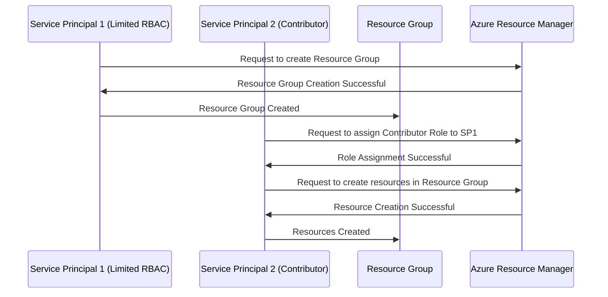

# Azure-RBAC

Here’s a Mermaid sequence diagram that illustrates the process of using two service principals with different RBAC roles for creating resource groups and assigning roles:

### Explanation:
1. **Service Principal 1 (SP1)** has a limited RBAC role that allows it to create **Resource Groups**.
2. **Service Principal 2 (SP2)** has a Contributor role, which gives it permissions to assign roles to others and create resources in the Resource Group.
3. **SP1** requests to create a resource group, and once created, it can interact with the Resource Group.
4. **SP2** assigns the Contributor role to **SP1** so that it can manage resources within the Resource Group.
5. **SP2** then creates the necessary resources in the Resource Group, leveraging its permissions.

This diagram illustrates how Service Principals with distinct roles can interact with Azure resources by adhering to the RBAC model.
