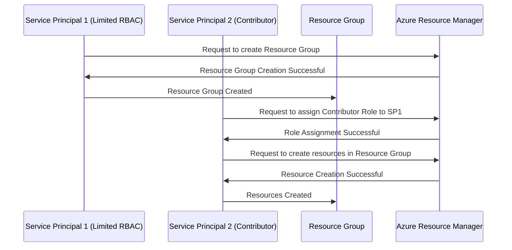

### Script: Query Azure Support Cases Across Multiple Subscriptions and Append to CSV

Replace the following placeholders:
- **`<OUTPUT_FILE>`**: Path to your CSV file, e.g., `C:\support_tickets.csv`.

#### Script:
```powershell
# Step 1: Get Access Token using Azure CLI
$AccessToken = az account get-access-token --query accessToken -o tsv

# Step 2: Define an Array of Subscription IDs
$Subscriptions = @(
    "<SUBSCRIPTION_ID_1>",
    "<SUBSCRIPTION_ID_2>",
    "<SUBSCRIPTION_ID_3>"
)

# Step 3: Set API Version and CSV Output Path
$ApiVersion = "2020-04-01"
$OutputFile = "<OUTPUT_FILE>"

# Step 4: Set Headers for Authorization
$Headers = @{
    "Authorization" = "Bearer $AccessToken"
    "Content-Type"  = "application/json"
}

# Step 5: Loop Through Each Subscription and Query Support Tickets
$AllSupportTickets = @()

foreach ($SubscriptionId in $Subscriptions) {
    Write-Host "Querying support tickets for Subscription: $SubscriptionId..." -ForegroundColor Cyan

    # Define API Endpoint
    $Uri = "https://management.azure.com/subscriptions/$SubscriptionId/providers/Microsoft.Support/supportTickets?api-version=$ApiVersion"

    try {
        # Invoke REST API
        $Response = Invoke-RestMethod -Uri $Uri -Headers $Headers -Method Get

        # Extract and Format Ticket Details
        $Tickets = $Response.value | ForEach-Object {
            [PSCustomObject]@{
                "SubscriptionID" = $SubscriptionId
                "TicketID"       = $_.name
                "Status"         = $_.properties.status
                "Title"          = $_.properties.title
                "Severity"       = $_.properties.severity
                "CreatedDate"    = $_.properties.createdDate
                "ModifiedDate"   = $_.properties.modifiedDate
                "ServiceName"    = $_.properties.serviceName
                "ContactMethod"  = $_.properties.contactMethod
            }
        }

        # Add to the Consolidated List
        $AllSupportTickets += $Tickets
    }
    catch {
        Write-Error "Failed to retrieve support tickets for Subscription $SubscriptionId. Error: $_"
    }
}

# Step 6: Append or Create CSV File
if ($AllSupportTickets) {
    if (Test-Path $OutputFile) {
        # Append to Existing CSV
        $AllSupportTickets | Export-Csv -Path $OutputFile -NoTypeInformation -Append
    } else {
        # Create New CSV
        $AllSupportTickets | Export-Csv -Path $OutputFile -NoTypeInformation
    }
    Write-Host "Support tickets appended to $OutputFile successfully!" -ForegroundColor Green
} else {
    Write-Host "No support tickets found for the provided subscriptions." -ForegroundColor Yellow
}
```

---

### How It Works:
1. **Access Token**: Obtained using Azure CLI.
2. **Subscription Array**: `$Subscriptions` contains all the subscription IDs you want to query.
3. **API Call**: Loops through each subscription ID and queries the Azure Support tickets.
4. **Data Formatting**: Extracts key properties like `TicketID`, `Status`, `Title`, and others.
5. **CSV Handling**: Consolidates data into a single CSV file. If the file already exists, it appends data; otherwise, it creates a new file.

---

### Output CSV Example:

| SubscriptionID     | TicketID | Status | Title                | Severity | CreatedDate          | ModifiedDate         | ServiceName      | ContactMethod |
|---------------------|----------|--------|----------------------|----------|----------------------|----------------------|------------------|---------------|
| SUBSCRIPTION_ID_1   | 12345    | Open   | VM Performance Issue | Moderate | 2024-06-10T10:45:00Z | 2024-06-11T08:15:00Z | Virtual Machines | Email         |
| SUBSCRIPTION_ID_2   | 67890    | Closed | Storage Issue        | Critical | 2024-06-01T12:00:00Z | 2024-06-05T10:00:00Z | Storage Accounts | Phone         |

---

### Execution Steps:
1. Save the script as `Query-MultiSubSupportTickets.ps1`.
2. Replace the subscription IDs in `$Subscriptions` and set your output file path.
3. Run the script in PowerShell:
   ```powershell
   .\Query-MultiSubSupportTickets.ps1
   ```

---


Here’s a Mermaid sequence diagram that illustrates the process of using two service principals with different RBAC roles for creating resource groups and assigning roles:



### Explanation:
1. **Service Principal 1 (SP1)** has a limited RBAC role that allows it to create **Resource Groups**.
2. **Service Principal 2 (SP2)** has a Contributor role, which gives it permissions to assign roles to others and create resources in the Resource Group.
3. **SP1** requests to create a resource group, and once created, it can interact with the Resource Group.
4. **SP2** assigns the Contributor role to **SP1** so that it can manage resources within the Resource Group.
5. **SP2** then creates the necessary resources in the Resource Group, leveraging its permissions.

This diagram illustrates how Service Principals with distinct roles can interact with Azure resources by adhering to the RBAC model.
