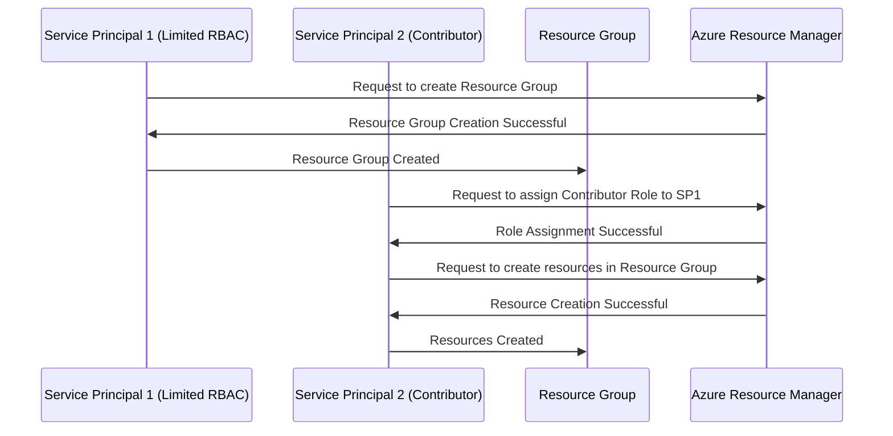

# Azure-RBAC
To query Azure Support cases using a **`curl`** command, you can utilize the **Azure Resource Manager REST API** for support tickets. Here's how:

---

### Prerequisites:
1. **Azure Authentication**: Get a **Bearer token** for authorization.
2. **Subscription ID**: Your Azure subscription ID.

---

### Step 1: Get an Access Token
Run the following command to obtain an access token via Azure CLI:

```bash
az account get-access-token --query accessToken --output tsv
```

This will output a **Bearer token**.

---

### Step 2: List Support Tickets with `curl`

Replace the placeholders:
- `<ACCESS_TOKEN>`: Your Azure Bearer token.
- `<SUBSCRIPTION_ID>`: Your Azure subscription ID.

```bash
curl -X GET "https://management.azure.com/subscriptions/<SUBSCRIPTION_ID>/providers/Microsoft.Support/supportTickets?api-version=2020-04-01" \
-H "Authorization: Bearer <ACCESS_TOKEN>" \
-H "Content-Type: application/json"
```

---

### Step 3: Filter Support Tickets by Status (e.g., Open)

Azure REST API does not directly filter on query parameters for support tickets, so you can filter the JSON response using tools like `jq`:

```bash
curl -X GET "https://management.azure.com/subscriptions/<SUBSCRIPTION_ID>/providers/Microsoft.Support/supportTickets?api-version=2020-04-01" \
-H "Authorization: Bearer <ACCESS_TOKEN>" \
-H "Content-Type: application/json" | jq '.value[] | select(.properties.status == "Open")'
```

---

### Response Example:
```json
{
  "id": "/subscriptions/<SUBSCRIPTION_ID>/providers/Microsoft.Support/supportTickets/12345",
  "name": "12345",
  "type": "Microsoft.Support/supportTickets",
  "properties": {
    "title": "Issue with VM Performance",
    "status": "Open",
    "severity": "Moderate",
    "createdDate": "2024-06-10T10:45:00Z"
  }
}
```

---

### Key Notes:
- **API Version**: Ensure you use the correct `api-version`, such as `2020-04-01`.
- Install **`jq`** for filtering JSON responses if needed:  
  - Ubuntu/Debian: `sudo apt install jq`  
  - macOS: `brew install jq`  
  - Windows: [Download jq](https://stedolan.github.io/jq/download/)

Let me know if you need help automating this or additional filters! 🚀


Here’s a Mermaid sequence diagram that illustrates the process of using two service principals with different RBAC roles for creating resource groups and assigning roles:



### Explanation:
1. **Service Principal 1 (SP1)** has a limited RBAC role that allows it to create **Resource Groups**.
2. **Service Principal 2 (SP2)** has a Contributor role, which gives it permissions to assign roles to others and create resources in the Resource Group.
3. **SP1** requests to create a resource group, and once created, it can interact with the Resource Group.
4. **SP2** assigns the Contributor role to **SP1** so that it can manage resources within the Resource Group.
5. **SP2** then creates the necessary resources in the Resource Group, leveraging its permissions.

This diagram illustrates how Service Principals with distinct roles can interact with Azure resources by adhering to the RBAC model.
